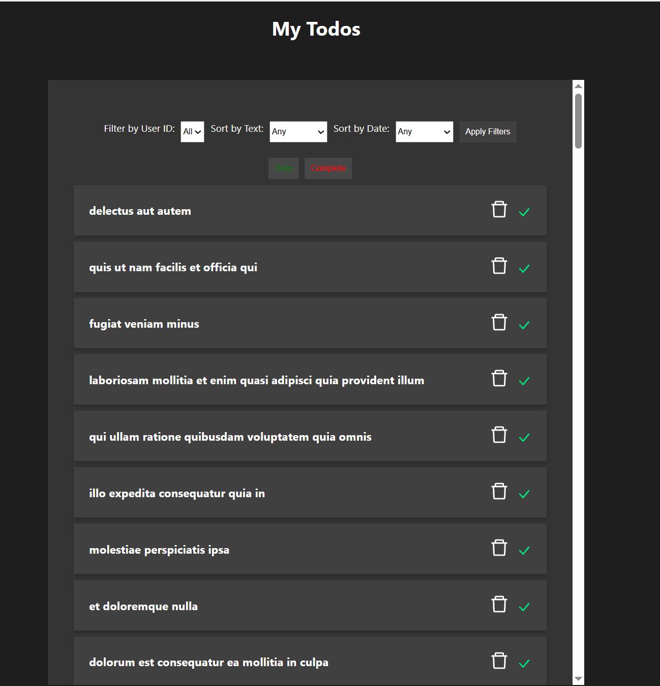
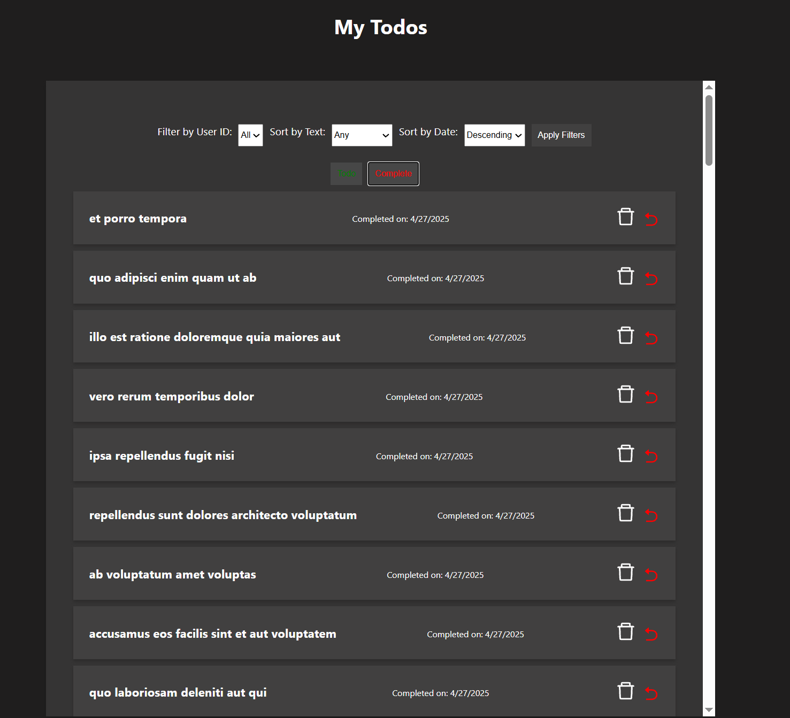
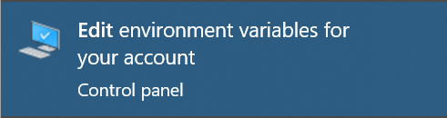
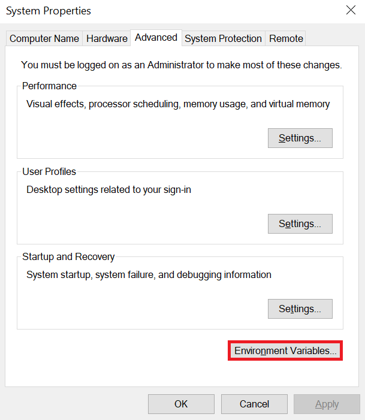
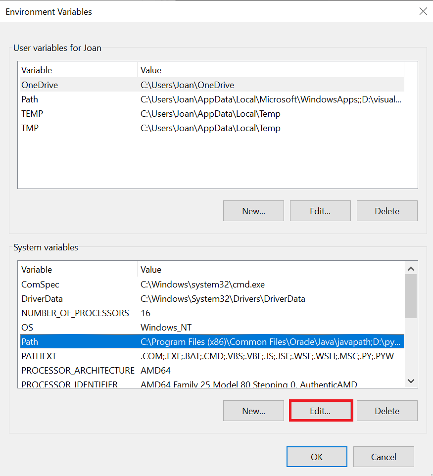
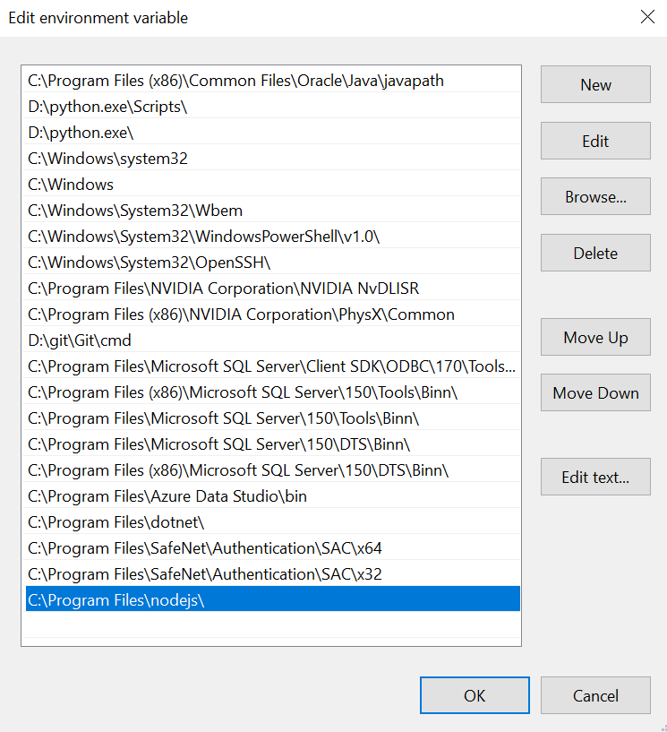

<table>
<colgroup>
<col style="width: 15%" />
<col style="width: 84%" />
</colgroup>
<thead>
<tr>
<th style="text-align: center;"></th>
<th style="text-align: center;">
<strong>ТЕХНИЧЕСКИ УНИВЕРСИТЕТ –
СОФИЯ</strong>

<strong>ФАКУЛТЕТ КОМПЮТЪРНИ СИСТЕМИ И ТЕХНОЛОГИИ</strong>
</th>
</tr>
</thead>
<tbody>
</tbody>
</table>

**КУРСОВ ПРОЕКТ**

1.  **Overview**

> "My Todos" е уеб приложение за управление на задачи с възможности за
> филтриране, изтриване, сортиране и маркиране на задачите като
> завършени или несвършени. Може да филтрирате по потребител, текст и
> дата.

> В началото сте в Todo частта на приложението. Тук можете да видите
> всички задачи, които не са направени. Те могат да се филтрират по
> userID и текст (asc / desc). На всяка задача в дясно са добавени и два
> бутона. Кошчето е за изтриване на задачата, когато тя вече не е
> релевантна или е имало объркване при задаването ѝ. Другият бутон е
> тикчето, което премества задачата в частта „Complete“, където се
> намират завършените задачи.
>
>  alt="A screenshot of a computer AI-generated content may be incorrect." />
>
> След натискане на бутона „Complete“ излиза списък с всички завършени
> задачи. Те, както преди, могат да се сортират по UserID и текст, но
> този път може да се сортират и по дата, в която са завършени, в реда
> „asc“ или „desc“. В самия списък има пак два бутона. Кошчето отново
> изтрива задачата изцяло. Бутонът е направен с опция, ако потребителите
> не искат да пазят история на повече от например 6 месеца, те имат
> възможност да я изтрият. Другият бутон, стрелката, премества задачата
> от „завършена“ в „несвършена“, ако случайно тя е била преместена в
> завършените по погрешка.

2.  **Prerequisites**

Преди да стартирате проекта, уверете се, че имате инсталирани:

- Visual studio code (можете да го инсталирате от
  [ТУК](https://code.visualstudio.com/download))

- Node.js (можете да го инсталирате от
  [ТУК](https://nodejs.org/en/download))

> След като сте инсталирали Node.js и Visual studio code отворете
> Command prompt(CMD) и проверете дали Node.js е инсталиран правилно с
> командите:

- node -v

- npm -v

Ако и на двете покаже версийте сте готови prerequisites. Ако не може да
има проблем с path за да разрешите този проблем. Отворете Edit
environment variables

След това изберете Еnvironment Variables доло дясно.

След това в долната част при system variables изберете Path и цъкнете
Edit

След това трябва да проверим дали има path към node.js и ако няма да го
добавим с new и слагаме path в края трябва да се вижда.

3.  **Steps to install dependencies**

Командите се поставят в терминала.

Клонирайте проекта:

- git clone https://github.com/barlibg/todolist.git

Инсталирайте необходимите библиотеки:

- npm install

<!-- -->

- npm i react-icons –save

> При проблем с някоя команда може да сте забранили стартирането на
> скриптова с тази команда временно ще можете да ги стартирате:
>
> Set-ExecutionPolicy -Scope Process -ExecutionPolicy Bypass

4.  **Instructions on how to run the app locally**

Командите се поставят в терминала.

За да стартираме приложението локално:

- npm start (ако има проблем пробвайте npm start 3001)

> При проблем с някоя команда може да сте забранили стартирането на
> скриптова с тази команда временно ще можете да ги стартирате:
>
> Set-ExecutionPolicy -Scope Process -ExecutionPolicy Bypass
